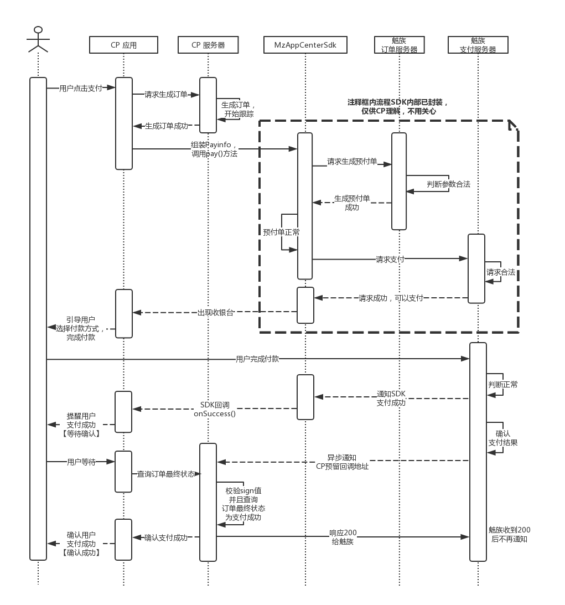

# MzAppCenterSdkDemo

| [魅族联运 SDK 2.0 迁移指南](README_MIGRATE.md) | [旧版魅族联运 SDK](README_OLD.md) |

魅族联运 SDK 接入 Demo。演示了如何初始化 SDK 与发起支付请求。

# 环境准备

1.在接入前，您需要按照[《应用联运服务接入指南》](http://open-wiki.flyme.cn/doc-wiki/index#id?119)完成`新建联运版本`的工作。

2.在`新建联运版本`时，您需要提供您应用**最终上架的生产环境版本**的签名信息，请访问[《应用联运SDK接入说明》][2]，使用文档中提到的 `MzSignfetcher` 工具获取它。

# 技术准备

1.魅族应用中心联运 SDK 只适用于 `Android Studio` 工程结构的项目。

2.魅族应用中心联运 SDK 要求使用魅族手机，并在支付前登录 [Flyme 账户](https://login.flyme.cn/)

3.您的项目需要[添加 Kotlin 支持](https://developer.android.com/studio/projects/add-kotlin)。过程非常简单，也可以使用 Andriod Studio -> Tools -> Kotlin -> Configure Kotlin in project，Android Studio 会自动帮助项目添加依赖插件。请放心，这不会影响现有项目以及 APK 大小，如果您还不熟悉 `Kotlin`，可以继续使用 `Java` 编写代码。但不管用何种语言开发，该插件必须添加以顺利通过编译。

# 时序图



# 下载 SDK 与 视觉资源

[下载地址][1]

# 开始接入

1.在项目 `app` 模块下新建 `libs/meizu` 目录，将下述文件拷贝至该目录，其中 `X` 以 [Release][1] 下载到的最新版本为准。

 - library-release.aar
 - MzAppCenterSdk_X.X.X(Build_X.X.X).aar

2.打开 `app` 的 `build.gradle`，在根节点声明：

``` groovy
repositories {
    flatDir {
        dirs 'libs/meizu'
    }
}
```
接着在 `dependencies{}` 闭包内添加如下声明：
``` groovy
// 遍历 'libs/meizu' 下的所有 `aar` 并引用
def meizuLibs = project.file('libs/meizu')
meizuLibs.traverse(nameFilter: ~/.*\.aar/) { file ->
    def name = file.getName().replace('.aar', '')
    implementation(name: name, ext: 'aar')
}

// 或者，以上也可以简写成下面这句，但老版本的 Android Gradle Plugin 可能无法识别，请按需启用
// implementation fileTree(dir: 'libs/meizu', include: ['*.aar'])

//以下第三方库为 SDK 内部引用，即使您的应用没有用到，也必须声明在此；
//相反，如果您的应用已经在使用，则可保留您自己的版本，不必再次声明
implementation "com.android.support:appcompat-v7:28.0.0"
implementation "com.google.code.gson:gson:2.8.2"
implementation "com.squareup.retrofit2:retrofit:2.4.0"
implementation "com.squareup.retrofit2:converter-gson:2.4.0"
```

3.在应用的 `Application` 类中初始化 SDK:

``` kotlin
class DemoApplication : Application() {
    override fun onCreate() {
        super.onCreate()
        MzAppCenterPlatform.init(this, "your_appKey")
    }
}
```
`MzAppCenterPlatform.init()` 方法的参数说明如下：

| 参数名 | 类型 | 是否必填 | 说明 |
| ------ | ------ | ------ | ------ |
| application | Application | 是 | 应用的 Application |
| appKey | String | 是 | 您在魅族开放平台[签约](http://open-wiki.flyme.cn/doc-wiki/index#id?119)完成后，在`联运参数`页面，位于 `APPPKEY` 后的一串值，**不要弄错** |
| debug | Boolean | 否 | SDK 内部 Log 开关，建议传 `<您的应用包名>.BuildConfig.Debug` |

4.调用接口先引导用户登录，已登录的用户会引导进行 `Oauth` 授权：
``` kotlin
private fun invokeSdkToLogin() {
        MzAppCenterPlatform.getInstance()?.login(ACTIVITY_REQUEST_CODE_AUTH, this, object : ILoginResultListener {

            override fun onError(code: Int, message: String?) {
                logMessage("× 登录失败，code = [$code], message = [$message]")
            }

            override fun onLoginSuccess() {
                logMessage("√ 登录成功，已经获取到 token，开始下预付单")
                invokeSdkToPay()
            }

        })
    }
```
5.如果用户未登录，会拉起登录引导页，因此**必须在 `onActivityResult()` 调用下述方法**：

```kotlin
override fun onActivityResult(requestCode: Int, resultCode: Int, data: Intent?) {
        super.onActivityResult(requestCode, resultCode, data)
        if (MzAppCenterPlatform.getInstance()?.onActivityResult(requestCode, resultCode, data) == true) {
            //用户成功授权，再次尝试获取 token
            invokeSdkToLogin()
        } else {
            if (requestCode == ACTIVITY_REQUEST_CODE_AUTH) { //ACTIVITY_REQUEST_CODE_AUTH 由应用调用 login() 时传入
                showToast("OAuth 授权失败，无法继续支付")
            } else {
                //应用自己其它的处理逻辑
            }
        }
    }
```
6.在用户登录并且获取到 `token` 后，调用下述方法开始支付：
```kotlin
private fun invokeSdkToPay() {
        MzAppCenterPlatform.getInstance()?.payV2(this, payInfo,
                object : IPayResultListener {
                    override fun onSuccess() {
                        logMessage("√ 支付成功")
                    }

                    override fun onFailed(code: Int, message: String) {
                        logMessage("× 支付失败，请根据 code 引导用户")
                    }
                })
    }
```

7.当页面退出，记得在 `onDestroyed()` 中调用此方法进行一些清理工作：
```kotlin
    MzAppCenterPlatform.getInstance()?.onDestroy()
```

# 接口文档
## login
| 参数名 | 类型 | 说明 |
| ------ | ------ | ------ |
| requestCode | Int |用来在 `onActivityResult()` 中区分此请求 |
| activity | Activity |调用支付接口的页面 |
| listener | ILoginResultListener | 登录结果回调 |

`ILoginResultListener` 为支付结果回调，具体说明如下：
``` kotlin
override fun onError(code: Int, message: String?) {
                logMessage("× 登录失败，code = [$code], message = [$message]")
}

            override fun onLoginSuccess() {
                logMessage("√ 登录成功，已经获取到 token，开始下预付单")
}
```
| code | message | 建议操作 |
| ------ | ------ | ------ |
| `LoginResult.CODE_ERROR_LOGIN_INTENT` | 登录 Intent 为空，请联系魅族 | 检查手机是否卸载了” Flyme 账号“应用
| `LoginResult.CODE_ERROR_LOGIN_GET_TOKEN_ERROR` | 获取 token 失败，请联系魅族 | 重启手机后重试

## onActivityResult
参照上述文档即可，SDK 通过标准的 Oauth2 流程获取 token，详见 https://developer.android.com/training/id-auth/authenticate 。

**请务必重写此方法**，因为在支付时如果发现用户未登录 Flyme 账户，SDK 会拉起登录页，不重写此方法会导致 SDK [无法感知登录完成](https://developer.android.com/training/id-auth/authenticate#RequestAgain)。

## payV2
| 参数名 | 类型 | 说明 |
| ------ | ------ | ------ |
| activity | Activity |调用支付接口的页面 |
| payInfo | PayInfo | 支付信息 |
| listener | IPayResultListener | 支付结果回调 |

`PayInfo` 为支付信息，包含订单标题、扣款金额等信息，由您构造后传入，具体说明如下：

| 参数名 | 类型 | 是否必填 | 说明 | 示例参数 |
| ------ | ------ | ------ | ------ |------ |
| createTime | Long | 是 | cp订单创建时间 | System.currentTimeMillis() |
| tradeNo | String | 是 | cp订单号 | "tradeNo" |
| productId | String | 是 | 商品ID | "productId"|
| productName | String | 是 | 商品名称 |  "productName" |
| productBody | String | 是 | 商品详情 | "productBody" |
| productUnit | String | 是 | 商品单位 | "份" |
| buyAmount | Integer | 是 | 购买数量 | 1 |
| perPrice | Double | 是 | 商品单价，单位 `元` | 0.01 |
| totalFee | Double | 是 | 购买总价，单位 `元` | 0.01 |
| notifyUrl| String | 是 | 魅族服务器主动通知 CP 服务器里指定的页面 http/https 路径。建议商户使用 https | https://api.xx.com/receive_notify |
| attach | String | 否 | CP自定义信息 | "attach" |

`IPayResultListener` 为支付结果回调，具体说明如下：
``` kotlin
override fun onSuccess() {
     //支付成功
}

override fun onFailed(code: Int, message: String) {
	//支付失败
}
```
**`onSuccess()` 只代表用户本地支付成功，后台需要处理以及最终确认状态。您不应该在这个回调里做任何的发货操作，因为这不完全可靠。请务必以魅族服务器回调您的支付通知 URL 为准，以此来认为用户最终支付成功。详见上方的时序图。**

`onFailed()` 中的 `code` 与 `message` 被定义在 `com.meizu.mstore.sdk.pay.PayResult`，您可以根据如下说明，结合实际情况给予用户相应引导：

| code | message | 建议操作 |
| ------ | ------ | ------ |
| `PayResult.CODE_ERROR_NETWORK_DISCONNECTED` | 无法连接网络，请检查网络设置 | 引导用户检查网络设置 |
| `PayResult.CODE_ERROR_USER_CANCEL` | 用户主动取消支付 | 告知用户取消了支付，引导用户重新发起 |
| `PayResult.CODE_ERROR_PREPAY_ORDER_ERROR` | 获取预支付订单失败 | 检查是否已与魅族签约<br>检查 SDK 初始化时传入的 `appKey` 是否正确<br>检查填写在魅族开放平台的`应用签名`是否由当前应用的签名生成<br>检查 `PayInfo` 构造是否正确<br>查看是否混淆导致<br>查看编译时控制台输出信息是否有异常 |
| `211013` | 应用签名校验失败(应用上线后不应遇到) | 开发者后台联运参数里填写的应用签名必须用 [MzSignfetcher][2] 获取，不接受其他任何随意填写的签名串<br>检查当前应用的签名，与开发者后台预留的签名是否一致<br>检查是不是在后台预留了正式环境的签名，而调用时却使用了 [debug.keystore](https://developer.android.com/studio/publish/app-signing#debug-mode)|
| `20003` 或 `100` | 支付信息验签不通过 | 1. SDK __不支持__` A 设备生成订单，B设备付款`，如果存在这种场景，请在同一台手机上生成新的订单，在构造`PayInfo`时 传给`tradeNo`。<br> 2. 检查手机本身的网络连接是否存在代理，或者连接的 WiFi 是否存在代理？SDK 不信任非 CA 颁发的证书 |
| 其它 `211XXX` | 服务端透传的失败信息 | 查看[服务端文档](https://github.com/MeizuAppCenter/MzAppCenterSdkServerDemo#%E5%B8%B8%E8%A7%81%E9%94%99%E8%AF%AF%E7%A0%81)或联系魅族技术支持 |

# ProGuard
1.请先确保您的应用已经引用了 [Android SDK 默认的混淆规则](https://developer.android.com/studio/build/shrink-code#shrink-code)，这也是 Android 开发规范：
``` proguard
    proguardFiles getDefaultProguardFile('proguard-android.txt')
```
2.其它混淆相关的配置文件已经包含在了 `aar` 中，您无需再关心 SDK 混淆问题。

# 常见问题

* 运行报错`java.lang.NoClassDefFoundError:Failed resolution of: Lkotlin/jvm/internal/Intrinsics`

  * 解决方法：请确保编译时添加了 `Kotlin` 插件。

* `Payinfo` 的 `totalFee` 已经变了，拉起的收银台显示价格却还是原来的

  * 解决方法：我们的订单体系，一旦`预付单`生成并且等待用户支付，价格是不允许再变化的。因此如果价格发生了变动，您需要重新 new 一个 `Payinfo` 并将 `tradeNo` 传新的，再重新调用 `payV2()` 方法，同时请在自身订单系统内建立好对应关系方便后期对账。关于`预付单`的解释请参见上方时序图。

* 老的订单重试支付一直失败

  * 您在我们订单体系内的`预付单`可能过期了。请尝试重新 new 一个 `Payinfo` 并将 `tradeNo` 传新的，再重新调用 `payV2()` 方法，同时请在自身订单系统内建立好对应关系方便后期对账。关于`预付单`的解释请参见上方时序图。


* 我的商品有优惠活动，价格应该怎么传？

  * 对于 `PayInfo` 的三个参数，魅族做了价格校验，即必须满足：
    > `buyAmount * perPrice = totalFee`  //数量 * 单价 = 总价
    
    因此如果您的商品有优惠活动，建议把优惠后的实际仍需扣款价格作为 `perPrice` 传入，同时请在自身订单系统内建立好对应关系方便后期对账，此时联运 SDK 仅作为收银台角色处理。

* 我的项目因为历史原因，`Android Gradle Plugin` 只能用 `2.3.X` 版本，`Kotlin` 插件要怎么接？

  * 请[参考这里](https://github.com/general-mobile/kotlin-architecture-components-notes-demo/blob/master/build.gradle)配置 `build.gradle`
  
* 用户支付完成后我该怎样查询订单最终状态？

  * 方法一
  
    客户端起一个轮询，每间隔数秒向服务端查询订单状态，确认最终成功后，执行发货操作，超时时间应当控制在 30s 以内。因为涉及钱财交易，超时后可以先报“支付成功，待确认”，不给用户造成心理负担，后续用户再次打开 app 或者查看订单的时候，再次查询订单状态并进行后续操作。

  * 方法二
  
    与客户端的 Push 结合，服务端收到支付状态更新后，给客户端 Push 一下，但要**注意验证 Push 的来源与真实性**。

  * 方法三
  
    做成让用户自己点击『我已完成支付』的形式，然后用户点击后，客户端去查询订单状态，再根据最终状态进行后续操作。


  [1]: https://github.com/MeizuAppCenter/MzAppCenterSdkDemo/releases
  [2]: http://open-wiki.flyme.cn/doc-wiki/index#id?118
  
  
# 报告问题

将 `MzAppCenterPlatform.init()` 第三个参数传 `true`，完整地重现一次问题，然后过滤 `MzAppCenterPlatform` 后，将 log 上报给魅族。